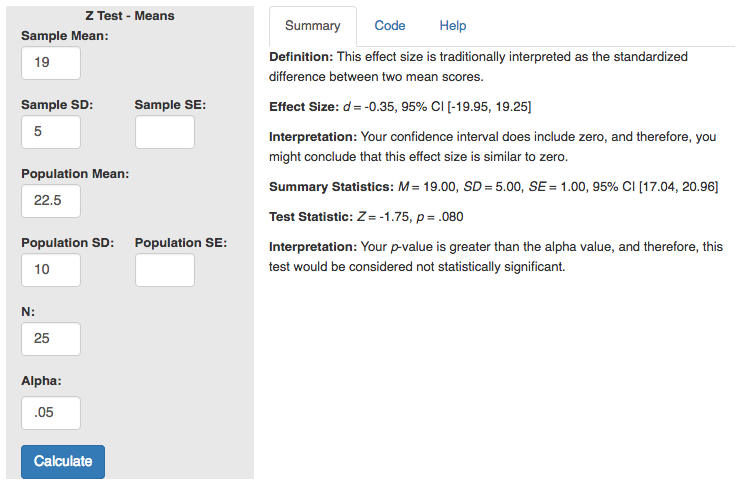

# Description   

GET THIS INFORMATION FROM THE HELP PAGE OF THE MOTE APP

# R Function

PUT THE R FUNCTION HERE 

# Arguments 

PUT THE ARGUMENTS HERE 

# Example  

INCLUDE AN EXAMPLE FROM 527

INCLUDE THE NUMBERS FOR THE ARGUMENT LISTED OUT 

# Function in R: 

INCLUDE THE FUNCTION HOW YOU WOULD WRITE IT IN R

# MOTE

## Screenshot

## Effect Size:

INCLUDE THE OUTPUT FROM MOTE

## Interpretation: 

INCLUDE INTERPRETATION FROM MOTE

## Summary Statistics: 

INCLUDE SUMMARY STATISTICS FROM MOTE

## Test Statistic: 

INCLUDE TEST STATISTICS FROM MOTE

## Interpretation: 

INCLUDE INTERPRETATION FROM MOTE

# Tutorial

ONLY CHANGE THE NUMBERS/LETTERS AFTER EMBED HERE. 

<iframe width="560" height="315" src="https://www.youtube.com/embed/CyfOS7Ew-Hw" frameborder="0" allow="autoplay; encrypted-media" allowfullscreen></iframe>
